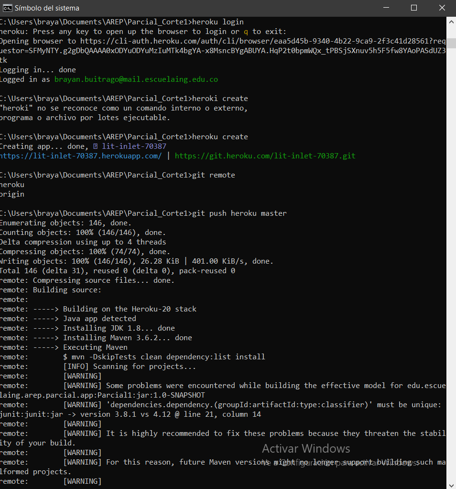
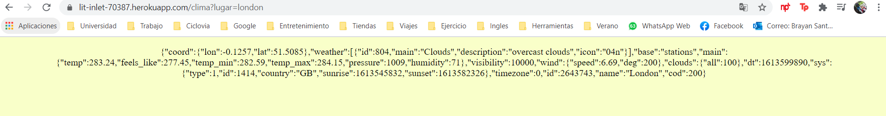

# PARCIAL CORTE 2

Aplicacion para consultar el clima de la ciudad que desee segun el reporte de la API gratuita de https://openweathermap.org/ de **Current Weather Data**

[](https://lit-inlet-70387.herokuapp.com/clima?lugar=london)

## README

Se creo una apliacion con la cual es posible consulta el clima de la ciudad que desee segun el reporte de la API gratuita de https://openweathermap.org/ de **Current Weather Data** para poder realizar esto el diseño se llevo acabo de la siguiente forma:
1. Como es de costumbre se genero el proyecto desde Maven
2. Posteriormente se conecto con el repositorio en git hub
3. Se configuro el achivo pom de esta forma: 

```

```

4. Posteriormente se realizo el desarrollo de cada una de las clases que se deseaban y requerian para el correcto funcioamiento, resumiendose en los componentes y la Aplicacion principal
	+ Los componentes se tratan de la conneccion con la API gratuita de https://openweathermap.org/ de **Current Weather Data** lo cual se realizo con dos clases usando como interface HTTP Connection
	+ Ademas de usar una clase para el cache y asi cumplir con el requerimiento de buscar en las consultas ya realizadas

5. Se realizo el debido despliegue con heroku desde la consola
Pero primeramente compilando con **Maven**


y posteriormente empaquetado con **Maven**


Para posteriormente realizar el despliegue:



Si todo esta en orden debera verse de la siguiente manera:



Algunos ejemplos:
```
https://lit-inlet-70387.herokuapp.com/clima?lugar=bogota
https://lit-inlet-70387.herokuapp.com/clima?lugar=medellin
https://lit-inlet-70387.herokuapp.com/clima?lugar=paris
https://lit-inlet-70387.herokuapp.com/clima?lugar=london
```


### Pre requisitos 

Es necesario contar con los siguientes programas para poder compilar, ejecutar y testar el proyecto:
+ Maven 3.6.3
+ Java 1.8.0
+ Git 2.25.0windows.1
+ jdl1.8.0_251


De esta forma es posible verificarla version de mvn y asi es como debe verse:

```

$ mvn -version

Apache Maven 3.6.3 (cecedd343002696d0abb50b32b541b8a6ba2883f)
Maven home: C:\Program Files\Java\apache-maven-3.6.3-bin\apache-maven-3.6.3
Java version: 14.0.2, vendor: Oracle Corporation, runtime: C:\Program Files\Java\jdk-14.0.2
Default locale: es_CO, platform encoding: Cp1252
OS name: "windows 10", version: "10.0", arch: "amd64", family: "windows"

```

Para verificar a version de Java se verifica de la siguiente manera:
```

$java -version

java version "1.8.0_261"
Java(TM) SE Runtime Environment (build 1.8.0_261-b12)
Java HotSpot(TM) 64-Bit Server VM (build 25.261-b12, mixed mode)

```


## Enunciado

Diseñé, construya y despliegue los siguientes servicios en un microcontenedor docker desplegado en una instancei a EC2 de AWS. Cada estudiante debe seleccionar para desarrollar dos funciones matemáticas de acuerdo a los dos últimos dígitos de su cédula como se especifica en la lista. Todas las funciones reciben un solo parámetro de tipo "Double" y retornan una prámetro sde tipo "Double".


0. log

1. ln

2. sin

3. cos

4. tan

5. acos

6. asin

7. atan

8. sqrt

9. exp (el número de eauler elevado ala potendia del parámetro)


Implemente los servicios para responder al método de solicitud HTTP GET. Deben usar el nombre de la función especificado en la lista y el parámetro debe ser pasado en la variable de query con nombre "value".


Ejemplo de una llamado:

https://amazonxxx.x.xxx.x.xxx:{port}/cos?value=3.141592


Salida. El formato de la salida y la respuesta debe ser un JSON con el siguiente formato

{

 "operation": "cos",

 "input":  3.141592,

 "output":  -0.999999

}


Entregable:

1. Proyecto actualizado en github

2. Descripción del proyecto enel README con pantalazos que muestren el funcionamiento.

3. Descripción de como correrlo en EC2

4. Video de menos de un minuto del funcionamiento (lo puede tomar con el celular una vez funcione)


## Pruebas

Se realizaron una serie de pruebas con el conjunto de numeros ubicado en [Pruebas.txt](https://github.com/DonSantiagoS/LAB1AREP.git/Pruebas.txt)

arrojando los siguientes resultados

usando este codigo como proyeccion de las pruebas que se realizaron:

```
```


## Construccion

* [Maven](https://maven.apache.org/) - Dependency Management
* [Git](https://git-scm.com/) - Used to execute, test and compile as console
* [Heroku] (https://heroku.com) - Used to deploy
* [ASW](https://www.awseducate.com/student/s/)- Used to
* [Docker](https://www.docker.com/) - Used to 

## Control de versiones

por: [Santiago Buitrago](https://github.com/DonSantiagoS) 

Version: 1.0
Fecha: 24 de marzo 2021

## Autor

* **Santiago Buitrago** - *Laboratorio N°1* - [DonSantiagoS](https://github.com/DonSantiagoS)

See also the list of [contributors](https://github.com/your/project/contributors) who participated in this project.

## Licencia 

This project is licensed under the MIT License - see the [LICENSE.md](LICENSE.md) file for details

## Agradecimientos

* Persistencia en lograr el objetivo

