# PARCIAL CORTE 2

Aplicacion para consultar el clima de la ciudad que desee segun el reporte de la API gratuita de https://openweathermap.org/ de **Current Weather Data**

[](https://lit-inlet-70387.herokuapp.com/clima?lugar=london)

## README

Se creo una apliacion con la cual es posible consulta el clima de la ciudad que desee segun el reporte de la API gratuita de https://openweathermap.org/ de **Current Weather Data** para poder realizar esto el diseño se llevo acabo de la siguiente forma:
1. Como es de costumbre se genero el proyecto desde Maven
2. Posteriormente se conecto con el repositorio en git hub
3. Se realizo la construccion de la Aplicacion de la siguiente forma, teniendo la aplicacion principal asi:

```
package edu.escuelaing.arep.parcial.app;

import edu.escuelaing.arep.parcial.app.componentes.*;
import java.io.IOException;
import spark.Request;
import spark.Response;
import static spark.Spark.*;
import com.google.gson.Gson;

/**
 * ---------------------------------------------------------------------------------------------------------------------------
 * ---------------------------------------------------------------------------------------------------------------------------
 * 													APLICACION PRINCIPAL
 * ---------------------------------------------------------------------------------------------------------------------------
 * Aplicacion encargada de manejar los diferentes servicios para asi llevar acabo las operaciones de los servicios ofrecidos
 * ---------------------------------------------------------------------------------------------------------------------------
 * @author Santiago Buitrago
 * @version 1.0
 * ---------------------------------------------------------------------------------------------------------------------------
 */
public class App {
	
	/**
	*	Main del spark quien realiza la consulta con las funciones Lampda
	*	segun las vistas que se soliciten en la aplicacion
	*	@param args
    */
    public static void main(String[] args) {
		
        port(getPort());
		get("/hello", (req, res) -> "Hello Don Santiago");
        get("/log", (req, res) -> resultLog(req, res));
		get("/acos", (req, res) -> resultAcos(req, res));
    }

	/**
	 *	Resultado de la aplicacion web bajo la solicitud realizada
	 *
	 *	@param req quien indica la informacion de la solicitud
	 *	@param res quien indica la informacion de respuesta
	 *	@return El clima en la ciudad solicitada en un json
	 */
	private static String resultLog(Request req, Response res) throws IOException {
		operacion operacionNueva= new operacion();
		String solicitud = req.queryParams("value");
		Double numero=Double.parseDouble(solicitud);
		Double resultado = operacionNueva.getLog(numero);
		String json=String.valueOf(resultado);
		Gson gson= new Gson();
		String respuesta= gson.toJson(operacionNueva);
		String pageContent
				= "<!DOCTYPE html>"
				+ "<html>"
				+ "<head>"
				+ "<style>"
				+ "body {text-align: center;"
				+ " font-family: \"new century schoolbook\";}"
				+ "h2 {text-align: center;}"
				+ "p {text-align: center;}"
				+ "a {text-align: center;}"
				+ "div {text-align: center;}"
				+ "form action {text-align: center;}"
				+ "</style>"
				+ "</head>"
				+"<title>OpenWeather</title>"
				+ "<body style=\"background-color:rgb(249,255,201);\">"
				+ "<p>"+respuesta +"</p>"
				+ "<br>"
				+ "</body>"
				+ "</html>";
		return pageContent;
	}
	
	/**
	 *	Resultado de la aplicacion web bajo la solicitud realizada
	 *
	 *	@param req quien indica la informacion de la solicitud
	 *	@param res quien indica la informacion de respuesta
	 *	@return El clima en la ciudad solicitada en un json
	 */
	private static String resultAcos(Request req, Response res) throws IOException {
		operacion operacionNueva= new operacion();
		String solicitud = req.queryParams("value");
		Double numero=Double.parseDouble(solicitud);
		Double resultado = operacionNueva.getAcos(numero);
		String json=String.valueOf(resultado);
		Gson gson= new Gson();
		String respuesta= gson.toJson(operacionNueva);
		String pageContent
				= "<!DOCTYPE html>"
				+ "<html>"
				+ "<head>"
				+ "<style>"
				+ "body {text-align: center;"
				+ " font-family: \"new century schoolbook\";}"
				+ "h2 {text-align: center;}"
				+ "p {text-align: center;}"
				+ "a {text-align: center;}"
				+ "div {text-align: center;}"
				+ "form action {text-align: center;}"
				+ "</style>"
				+ "</head>"
				+"<title>OpenWeather</title>"
				+ "<body style=\"background-color:rgb(249,255,201);\">"
				+ "<p>"+respuesta +"</p>"
				+ "<br>"
				+ "</body>"
				+ "</html>";
		return pageContent;
	}
	
    /**
     * This method reads the default port as specified by the PORT variable in
     * the environment.
     *
     * Heroku provides the port automatically so you need this to run the
     * project on Heroku.
     */
    static int getPort() {
        if (System.getenv("PORT") != null) {
            return Integer.parseInt(System.getenv("PORT"));
        }
        return 4567; //returns default port if heroku-port isn't set (i.e. on localhost)
    }

}

```

y la clase de operacion de la siguiente manera:

```
package edu.escuelaing.arep.parcial.app.componentes;

import java.io.IOException;
import java.util.concurrent.ConcurrentHashMap;
import java.lang.Math;

/**
 * ---------------------------------------------------------------------------------------------------------------------------
 * ---------------------------------------------------------------------------------------------------------------------------
 * 													OPERACION
 * ---------------------------------------------------------------------------------------------------------------------------
 * Clase: Operacion
 * Encargada de realizar las operaciones solicitadas funciones como log o acos
 * ---------------------------------------------------------------------------------------------------------------------------
 * @author Santiago Buitrago
 * @version 1.0
 * ---------------------------------------------------------------------------------------------------------------------------
 */

public class operacion {
	
	private String operacion;
	private Double input;
	private Double output;
	 
	
    public operacion() {

    }

    public Double getLog(Double solicitud) {
        Double respuesta=Math.log10(solicitud);
		input=solicitud;
		output=respuesta;
		operacion="log";
        return respuesta;
    }

    public Double getAcos(Double solicitud) {
        Double respuesta=Math.acos(solicitud);
		input=solicitud;
		output=respuesta;
		operacion="acos";
        return respuesta;
    }
}
```

4. Posteriormente se realizo la importacion de las dependencias SparkJava en el archivo pom asi:

```
<dependencies>
        <!-- https://mvnrepository.com/artifact/com.sparkjava/spark-core -->
        <dependency>
            <groupId>com.sparkjava</groupId>
            <artifactId>spark-core</artifactId>
            <version>2.9.2</version>
        </dependency>
    </dependencies>
```


5.  Se realizo la adecuacion del ambiente

```
<properties>
        <project.build.sourceEncoding>UTF-8</project.build.sourceEncoding>
        <maven.compiler.source>8</maven.compiler.source>
        <maven.compiler.target>8</maven.compiler.target>
</properties>
```

6. Se realizo la verififacion de que las dependencias se estuvieran copiando en el directorio target al compilar el proyecto

```
  <build>
        <plugins>
            <plugin>
                <groupId>org.apache.maven.plugins</groupId>
                <artifactId>maven-dependency-plugin</artifactId>
                <version>3.0.1</version>
                <executions>
                    <execution>
                        <id>copy-dependencies</id>
                        <phase>package</phase>
                        <goals><goal>copy-dependencies</goal></goals>
                    </execution>
                </executions>
            </plugin>
        </plugins>
    </build>
```
7. mvn clean install

se verifico que compilara con **Maven**
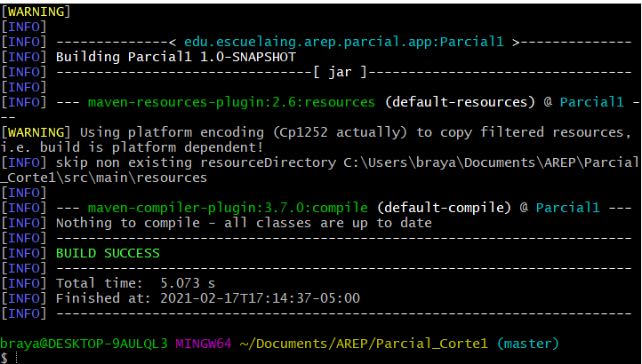

y posteriormente empaquetado con **Maven**

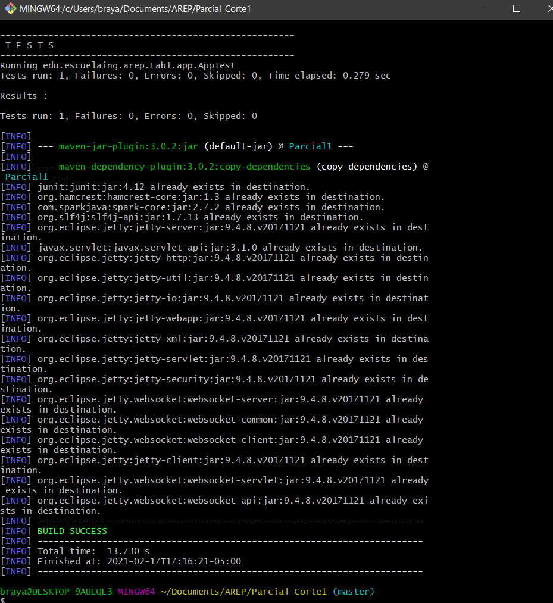


8. Adicionalmente fue necesario verificar que las dependencias se encontraban correctamente

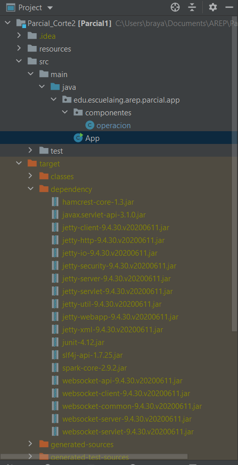

9. Se realizo la verificacion del funcionamiento en localhost:

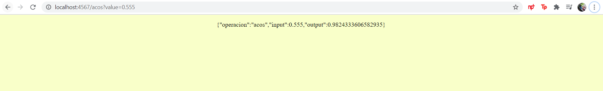

10. En la raiz del proyecto se creo un archivo demominado Dockerfile con el siguiente contenido:

```
FROM openjdk:8

WORKDIR /usrapp/bin

ENV PORT 6000

COPY /target/classes /usrapp/bin/classes
COPY /target/dependency /usrapp/bin/dependency

CMD ["java","-cp","./classes:./dependency/*","edu.escuelaing.arep.parcial.app.App"]


```

11. Con el comando docker build --tag dockersparkprimer . se realizo la construccion de la imagen en Docker

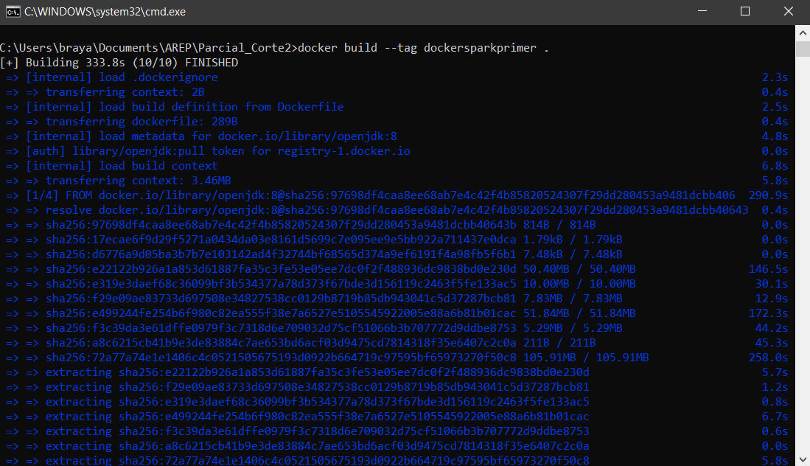

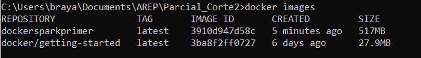

12. Apartir de esta imagen creada se construyeron tres instancias de un contenedor docker

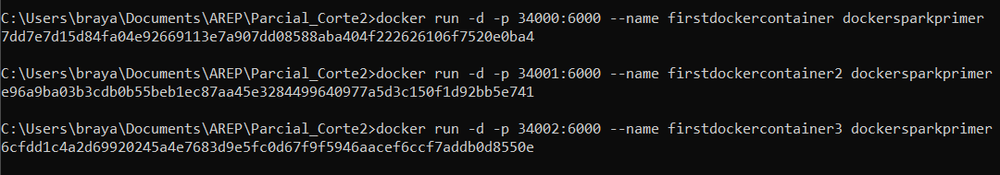

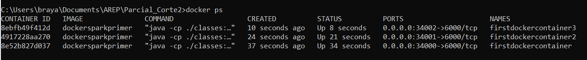

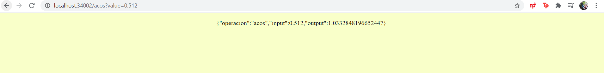

13. Se creo el archivo docker-compose.yml para poder utilizar el docker-compose

```
version: '2'


services:
    web:
        build:
            context: .
            dockerfile: Dockerfile
        container_name: web
        ports:
            - "8087:6000"
    db:
        image: mongo:3.6.1
        container_name: db
        volumes:
            - mongodb:/data/db
            - mongodb_config:/data/configdb
        ports:
            - 27017:27017
        command: mongod
        
volumes:
    mongodb:
    mongodb_config:
```

14. docker-compose up -d y se verificaron los servicios

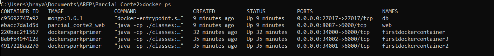

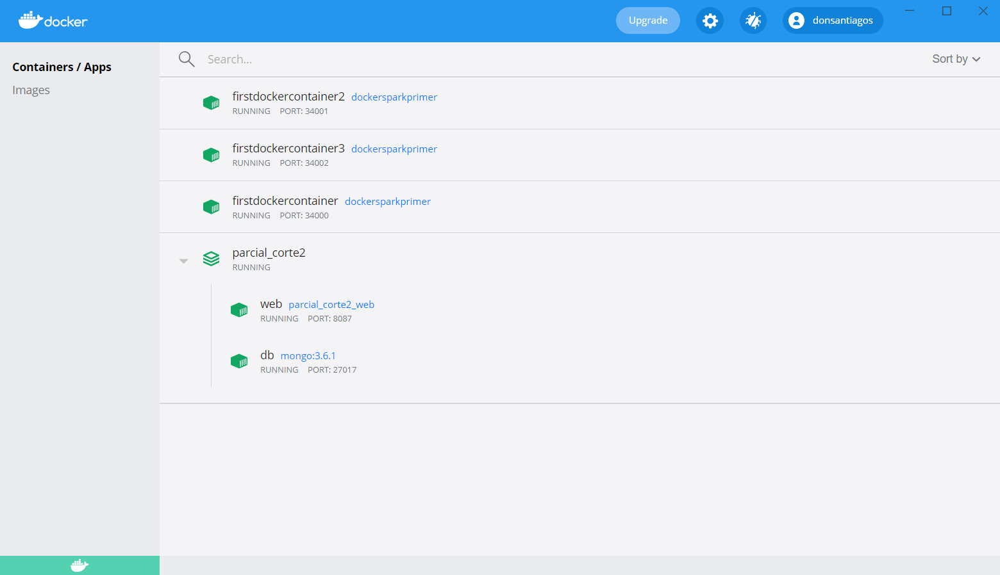


15.  Con el siguiente comando se hizo la coneccion al repositorio de DockerHub

docker tag dockersparkprimer donsantiagos/parcialarep2

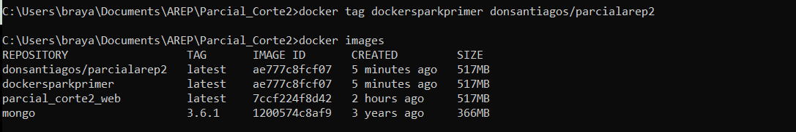

16. Se realiza Push al repositorio docker push donsantiagos/parcialarep2:latest

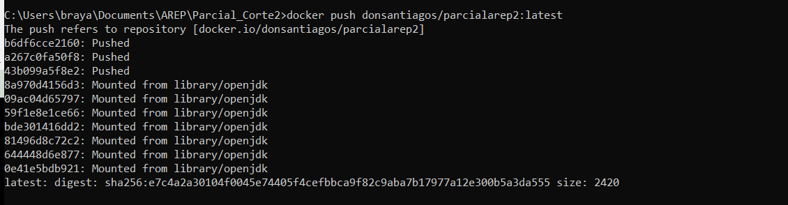


17. Se instalo Docker en la maquina virtual de AWS

sudo yum update -y
sudo yum install docker

18. Se inicia el servicio de Docker

sudo service docker start

19. Apartir de la imagen creada en DockerHub se creo una instancia de un contenedor docker

docker run -d -p 42000:6000 --name firstdockerimageaws donsantiagos/parcialarep2

### Pre requisitos 

Es necesario contar con los siguientes programas para poder compilar, ejecutar y testar el proyecto:
+ Maven 3.6.3
+ Java 1.8.0
+ Git 2.25.0windows.1
+ jdl1.8.0_251


De esta forma es posible verificarla version de mvn y asi es como debe verse:

```

$ mvn -version

Apache Maven 3.6.3 (cecedd343002696d0abb50b32b541b8a6ba2883f)
Maven home: C:\Program Files\Java\apache-maven-3.6.3-bin\apache-maven-3.6.3
Java version: 14.0.2, vendor: Oracle Corporation, runtime: C:\Program Files\Java\jdk-14.0.2
Default locale: es_CO, platform encoding: Cp1252
OS name: "windows 10", version: "10.0", arch: "amd64", family: "windows"

```

Para verificar a version de Java se verifica de la siguiente manera:
```

$java -version

java version "1.8.0_261"
Java(TM) SE Runtime Environment (build 1.8.0_261-b12)
Java HotSpot(TM) 64-Bit Server VM (build 25.261-b12, mixed mode)

```


## Enunciado

Diseñé, construya y despliegue los siguientes servicios en un microcontenedor docker desplegado en una instancei a EC2 de AWS. Cada estudiante debe seleccionar para desarrollar dos funciones matemáticas de acuerdo a los dos últimos dígitos de su cédula como se especifica en la lista. Todas las funciones reciben un solo parámetro de tipo "Double" y retornan una prámetro sde tipo "Double".


0. log

1. ln

2. sin

3. cos

4. tan

5. acos

6. asin

7. atan

8. sqrt

9. exp (el número de eauler elevado ala potendia del parámetro)


Implemente los servicios para responder al método de solicitud HTTP GET. Deben usar el nombre de la función especificado en la lista y el parámetro debe ser pasado en la variable de query con nombre "value".


Ejemplo de una llamado:

https://amazonxxx.x.xxx.x.xxx:{port}/cos?value=3.141592


Salida. El formato de la salida y la respuesta debe ser un JSON con el siguiente formato

{

 "operation": "cos",

 "input":  3.141592,

 "output":  -0.999999

}


Entregable:

1. Proyecto actualizado en github

2. Descripción del proyecto enel README con pantalazos que muestren el funcionamiento.

3. Descripción de como correrlo en EC2

4. Video de menos de un minuto del funcionamiento (lo puede tomar con el celular una vez funcione)


## Pruebas

Se realizaron una serie de pruebas con el conjunto de numeros ubicado en [Pruebas.txt](https://github.com/DonSantiagoS/LAB1AREP.git/Pruebas.txt)

arrojando los siguientes resultados

usando este codigo como proyeccion de las pruebas que se realizaron:

```
```


## Construccion

* [Maven](https://maven.apache.org/) - Dependency Management
* [Git](https://git-scm.com/) - Used to execute, test and compile as console
* [Heroku] (https://heroku.com) - Used to deploy
* [ASW](https://www.awseducate.com/student/s/)- Used to
* [Docker](https://www.docker.com/) - Used to 

## Control de versiones

por: [Santiago Buitrago](https://github.com/DonSantiagoS) 

Version: 1.0
Fecha: 24 de marzo 2021

## Autor

* **Santiago Buitrago** - *Laboratorio N°1* - [DonSantiagoS](https://github.com/DonSantiagoS)

See also the list of [contributors](https://github.com/your/project/contributors) who participated in this project.

## Licencia 

This project is licensed under the MIT License - see the [LICENSE.md](LICENSE.md) file for details

## Agradecimientos

* Persistencia en lograr el objetivo

